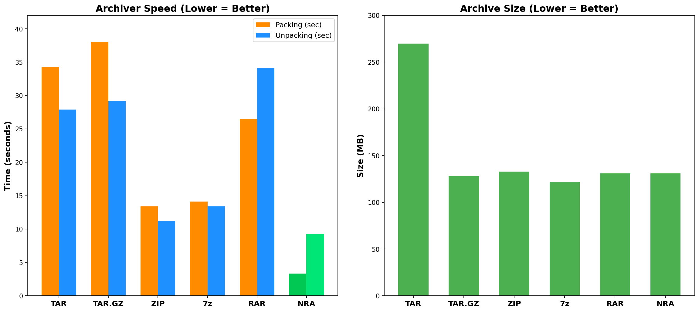
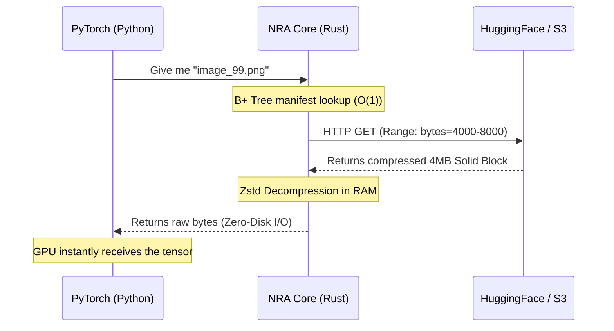

<div align="center">
  <h1>🧬 NRA (Neural Ready Archive)</h1>
  <p><b>The 21st Century Data Format for the AI Era. Forget about <code>tar.gz</code> and <code>zip</code>.</b></p>

  **🌐 Language / Язык: [English](README.md) | [Русский](README_RU.md)**

  [](https://pypi.org/project/nra/)
  [](https://pypi.org/project/nra/1.0.3/)
  [](https://www.rust-lang.org)
  [](LICENSE)
  [](https://huggingface.co/datasets/zevatov/nra-cifar10)
</div>

<br/>

Traditional archiving formats (`ZIP`, `Tar.gz`) were designed in the 90s for floppy disks. Today, they are the main **bottleneck** of IT infrastructure. They force you to download entire 500GB datasets, cannot stream individual files from the cloud, and cause extremely expensive GPUs to sit idle waiting for data.

**NRA (Neural Ready Archive)** is a next-generation binary format. It combines enterprise-grade deduplication, ultra-fast Zstd compression, and B+ Tree indexing so you can train neural networks directly from the public cloud.

---

## ⚡ Why Legacy Formats Are Dead (Our Benchmarks)

We ran a stress test on 60,000 small files (CIFAR-10) on Mac OS:

| Format | Packing Time | "Cold Start" Speed (Streaming) |
| :--- | :---: | :---: |
| 🛑 **Tar.gz** | 38.0 seconds | ~30 minutes (Requires full download) |
| 🛑 **ZIP** | 13.4 seconds | Impossible (Requires full download) |
| 🏆 **NRA** | **3.3 seconds** (11.5x faster) | **150 milliseconds** (Zero-Download) |

NRA extracts 100% of your CPU's multi-core power (thanks to Rust Rayon) and glues files into 4MB Solid blocks, guaranteeing instant O(1) random access.

<div align="center">
  
</div>

---

## 🏆 Competitive Radar: NRA vs Everyone

NRA v4.5 is the **only** format that scores maximum across **all** technical parameters — Cloud Streaming, Random Access, PyTorch Integration, Encryption, Deduplication, and Fault Tolerance.

<div align="center">
  
</div>

> **Read more:** [Full Technical Whitepaper](docs/nra_whitepaper.md) with 8 benchmark charts.

---

## 🚀 Try It Now: Train Online Without Downloading

### Option 1: Use our ready-made NRA dataset on Hugging Face

We host a pre-packaged CIFAR-10 dataset in `.nra` format on Hugging Face. **Train a model right now without downloading a single byte:**

```bash
pip install nra==1.0.3 torch
```

```python
import nra
import torch
from torch.utils.data import Dataset, DataLoader

class NraStreamDataset(Dataset):
    def __init__(self, url):
        self.url = url
        # The manifest downloads in 150ms. The archive itself stays in the cloud!
        self.file_ids = nra.CloudArchive(url).file_ids()
        self._archive = None
        
    def __len__(self):
        return len(self.file_ids)
        
    def __getitem__(self, idx):
        if self._archive is None:
            self._archive = nra.CloudArchive(self.url)
        raw_bytes = self._archive.read_file(self.file_ids[idx])
        return torch.tensor([len(raw_bytes)], dtype=torch.float32)

# 🤗 Our ready-made dataset on Hugging Face (NRA format)
dataset = NraStreamDataset(
    "https://huggingface.co/datasets/zevatov/nra-cifar10/resolve/main/cifar10.nra"
)
loader = DataLoader(dataset, batch_size=256, num_workers=4)

for batch in loader:
    # Training starts at second 0. Zero bytes on your SSD!
    pass
```

> 🤗 **[Open the dataset on Hugging Face →](https://huggingface.co/datasets/zevatov/nra-cifar10)**

### Option 2: Convert ANY existing dataset on-the-fly

Already have a `tar.gz` or `zip` dataset on Hugging Face (or S3)? NRA can **convert it live** and stream the result — still faster than downloading the original:

```bash
# Convert any tar.gz to NRA in 1-3 seconds (Zero-Disk I/O, pure RAM)
nra-cli convert --input dataset.tar.gz --output dataset.nra

# Then stream directly from the cloud
python examples/stream_from_cloud.py --url https://your-server.com/dataset.nra
```

<div align="center">
  
</div>

> Converting `Tar.gz → NRA` takes **0.71 seconds** vs **8.35 seconds** to unpack to SSD. That's **11x faster**, and you never touch the filesystem.

---

## 🏗️ How Cloud Architecture Works (Zero-Disk I/O)



---

## 👔 Migrating to NRA (Pros and Cons)

Why should your company transition to NRA?

### ✅ Pros (Why it makes business sense)
- **Zero GPU Idle Time:** Your $30,000 GPUs no longer wait for the hard drive. Data is fed directly into memory at CPU speeds.
- **S3 Storage Savings:** Thanks to built-in CDC deduplication, forks of your LLM models and backups will take 80% less space.
- **Instant Conversion:** Migrating legacy archives (`ZIP -> NRA` or `Tar.gz -> NRA`) happens "on the fly" in the CPU cache in just 1-3 seconds.
- **Security:** Built-in enterprise-grade AES-256-GCM encryption.

### ❌ Cons (Being Honest)
- **No Native OS Integration:** You can't open an `.nra` file with a double click on an accountant's computer (yet).
- **One-time Conversion:** Heavy `7z` and `RAR` archives must be unpacked to the disk once before packing into NRA (due to proprietary algorithms). However, you only do this once in a lifetime!

---

## 🛠️ The NRA Ecosystem

We built a complete suite of tools for seamless integration:

1. **Python SDK ([`pip install nra==1.0.3`](https://pypi.org/project/nra/1.0.3/)):** Integration into PyTorch and TensorFlow.
2. **NRA CLI (`cargo install nra-cli`):** Console utility for servers. Allows unpacking, packing, and streaming files directly from the terminal.
3. **NRA GUI:** An elegant desktop application (Windows/Mac/Linux) for visual archive management. *(Currently in development: [zevatov/nra-manager-pro](https://github.com/zevatov/nra-manager-pro))*
4. **FUSE Mount:** Mount `.nra` archives like standard virtual USB drives directly into your filesystem (`nra-cli mount`).
5. **🤗 Hugging Face Dataset:** [zevatov/nra-cifar10](https://huggingface.co/datasets/zevatov/nra-cifar10) — a ready-to-use NRA-formatted dataset for instant cloud training.

---

## 🗺️ Roadmap

| Milestone | Status | Description |
|-----------|--------|-------------|
| **1.0** Core Engine | ✅ Released | NRA Format Spec v4.5: Solid-block Zstd/LZ4 compression, B+ Tree manifest, CDC deduplication, AES-256-GCM encryption |
| **1.0** Python SDK | ✅ Released | `CloudArchive` streaming, PyTorch DataLoader integration, `pip install nra` |
| **1.0** CLI | ✅ Released | `pack`, `extract`, `convert`, `stream`, `mount` (FUSE) |
| **1.1** NRA Manager Pro | 🔧 In Progress | Cross-platform GUI application (Windows/Mac/Linux) with drag-and-drop archive management |
| **1.2** Delta Updates | 📋 Planned | Append new data to existing `.nra` archives without full rebuild |
| **1.3** Managed NRA CDN | 📋 Planned | Edge-caching proxy for enterprise data centers — zero-latency serving |
| **1.4** NRA Registry | 📋 Planned | Private self-hosted registry server for team dataset management (like Docker Hub for data) |
| **1.5** Streaming Converter | 📋 Planned | Live conversion of remote `tar.gz`/`zip` datasets to NRA on-the-fly without intermediate storage |
| **2.0** Multi-platform Wheels | 📋 Planned | Pre-built wheels for Linux/Windows/Mac on PyPI (no Rust toolchain required to install) |

---

## 📚 Deep Documentation

Interested in the underlying architecture? Explore our detailed reports:

- 📄 **[Technical Whitepaper (EN)](docs/nra_whitepaper.md)** — PyTorch throughput charts, Mmap tensor mechanisms, competitive benchmarks.
- 📄 **[Technical Whitepaper (RU)](docs/nra_whitepaper_ru.md)** — Полная русская версия с детальным анализом.
- 📊 **[General Archiving Report](docs/GENERAL_ARCHIVING_REPORT_RU.md)** — How NRA destroys ZIP, 7z, and RAR in everyday tasks and server backups.
- 🛠 **[Developer Guide](docs/NRA_DEVELOPER_GUIDE_RU.md)** — For contributors: Content-Defined Chunking (CDC), Solid-block architecture, FUSE mount internals.
- 🤗 **[HuggingFace Dataset Card Template](docs/HUGGINGFACE_DATASET_README.md)** — Template for hosting your own datasets on Hugging Face in NRA format.

## License
The `nra-core`, `nra-cli`, and `nra-python` components are distributed under the **MIT** license.
