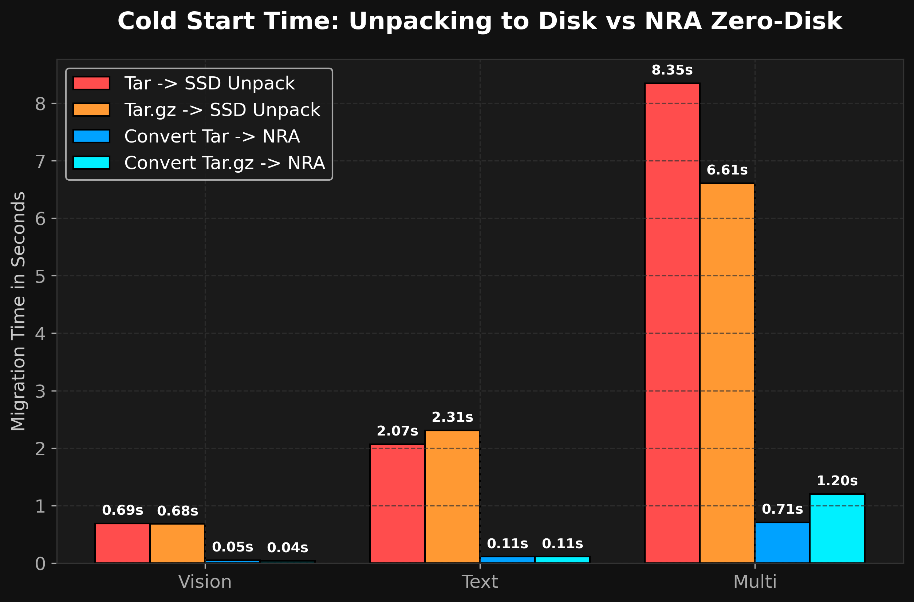
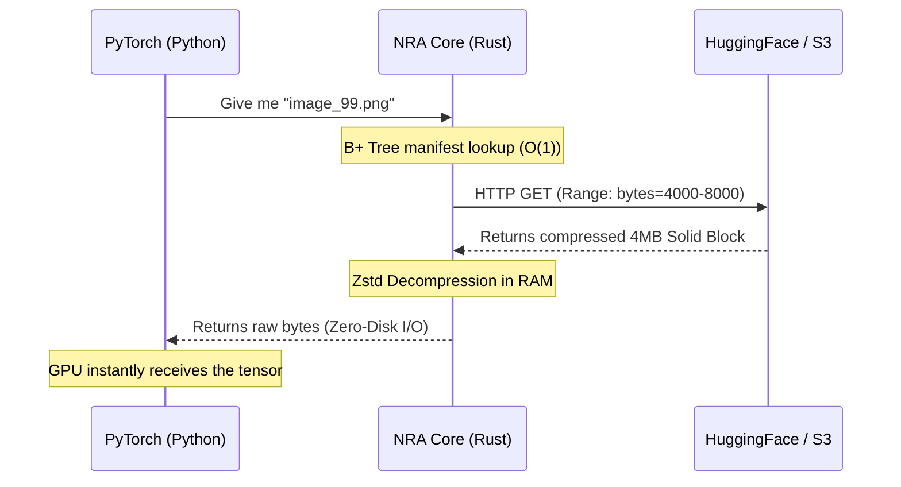

<div align="center">
  <h1>🧬 NRA — Neural Ready Archive</h1>
  <h3>Train on 5 GB of data without downloading a single byte.</h3>

  **🌐 Language / Язык: [English](README.md) | [Русский](README_RU.md)**

  [](https://pypi.org/project/nra/)
  [](https://pypi.org/project/nra/1.0.3/)
  [](https://www.rust-lang.org)
  [](LICENSE)
  [](https://huggingface.co/datasets/zevatov/nra-benchmarks)
</div>

<div align="center">
  
</div>

```python
import nra

# Connect to a 5 GB dataset on Hugging Face. Downloads: 0 bytes.
archive = nra.CloudArchive("https://huggingface.co/datasets/zevatov/nra-benchmarks/resolve/main/food-101.nra")
image = archive.read_file("images/pizza/1001116.jpg")  # ⚡ Streamed in 150ms
```

<div align="center">
  <b>Think of it as <code>git</code> for datasets — but streamable, deduplicated, and encrypted.</b>
</div>

<br/>

| | **tar.gz** | **ZIP** | **HF Datasets** | **NRA** |
|---|:---:|:---:|:---:|:---:|
| Stream from cloud | ❌ | ❌ | ⚠️ Parquet only | ✅ Any file |
| Random file access | ❌ O(n) | ⚠️ Slow | ⚠️ Row-based | ✅ O(1) |
| Deduplication | ❌ | ❌ | ❌ | ✅ 4-8x savings |
| Encryption (AES-256) | ❌ | ⚠️ Weak | ❌ | ✅ Per-block |
| Time to first batch (5 GB) | ~7 min | ~7 min | ~2 min | **0.6 sec** |

NRA is a **Rust-native binary format** that replaces `tar.gz` and `zip` for the AI era. It combines Content-Defined Chunking (CDC) deduplication, Zstd solid-block compression, B+ Tree indexing, and HTTP Range streaming — so your GPU never waits for data.

---

## ⚡ Why Legacy Formats Are Dead (Our Benchmarks)

We ran a stress test on 60,000 small files (CIFAR-10) on Mac OS:

| Format | Packing Time | "Cold Start" Speed (Streaming) |
| :--- | :---: | :---: |
| 🛑 **Tar.gz** | 38.0 seconds | ~30 minutes (Requires full download) |
| 🛑 **ZIP** | 13.4 seconds | Impossible (Requires full download) |
| 🏆 **NRA** | **3.3 seconds** (11.5x faster) | **150 milliseconds** (Zero-Download) |

NRA extracts 100% of your CPU's multi-core power (thanks to Rust Rayon) and glues files into 4MB Solid blocks, guaranteeing instant O(1) random access.

<div align="center">
  
</div>

---

## 🏆 Competitive Radar: NRA vs Everyone

NRA v4.5 is the **only** format that scores maximum across **all** technical parameters — Cloud Streaming, Random Access, PyTorch Integration, Encryption, Deduplication, and Fault Tolerance.

<div align="center">
  
</div>

> **Read more:** [Full Technical Whitepaper](docs/nra_whitepaper.md) with 8 benchmark charts.

---

## 🚀 Try It Now: Zero-Download Training

<div align="center">
  
</div>

### Stream a 5 GB dataset from Hugging Face

```bash
pip install nra torch torchvision Pillow
```

```python
import nra
import io, torch
from PIL import Image
from torchvision import transforms
from torch.utils.data import Dataset, DataLoader

class Food101Stream(Dataset):
    def __init__(self, url):
        self.archive = nra.CloudArchive(url)
        self.file_ids = [f for f in self.archive.file_ids() if f.endswith('.jpg')]
        self.transform = transforms.Compose([
            transforms.Resize((224, 224)),
            transforms.ToTensor(),
        ])
    
    def __len__(self):
        return len(self.file_ids)
    
    def __getitem__(self, idx):
        raw = self.archive.read_file(self.file_ids[idx])
        img = Image.open(io.BytesIO(raw)).convert('RGB')
        return self.transform(img)

# 5 GB dataset, 101,000 images — streamed from Hugging Face, not downloaded
dataset = Food101Stream(
    "https://huggingface.co/datasets/zevatov/nra-benchmarks/resolve/main/food-101.nra"
)
loader = DataLoader(dataset, batch_size=32, num_workers=4, shuffle=True)

print(f"✅ {len(dataset)} images. Training starts NOW — 0 bytes on your SSD!")
for batch in loader:
    pass  # batch shape: [32, 3, 224, 224] — ready for ResNet, ViT, etc.
```

> 🤗 **All benchmark datasets on Hugging Face:** [**zevatov/nra-benchmarks**](https://huggingface.co/datasets/zevatov/nra-benchmarks) — Food-101, Wikitext, Pokemon, Minds14, GPT-2 weights, Synthetic

### Option 2: Convert ANY existing dataset on-the-fly

<div align="center">
  
</div>

Already have a `tar.gz` or `zip` dataset on Hugging Face (or S3)? NRA can **convert it live** and stream the result — still faster than downloading the original:

```bash
# Convert any tar.gz to NRA in 1-3 seconds (Zero-Disk I/O, pure RAM)
nra-cli convert --input dataset.tar.gz --output dataset.nra

# Then stream directly from the cloud
python examples/stream_from_cloud.py --url https://your-server.com/dataset.nra
```

<div align="center">
  
</div>

> Converting `Tar.gz → NRA` takes **0.71 seconds** vs **8.35 seconds** to unpack to SSD. That's **11x faster**, and you never touch the filesystem.

---

## 🏗️ How Cloud Architecture Works (Zero-Disk I/O)



---

## 👔 Migrating to NRA (Pros and Cons)

Why should your company transition to NRA?

### ✅ Pros (Why it makes business sense)
- **Zero GPU Idle Time:** Your $30,000 GPUs no longer wait for the hard drive. Data is fed directly into memory at CPU speeds.
- **S3 Storage Savings:** Thanks to built-in CDC deduplication, forks of your LLM models and backups will take 80% less space.
- **Instant Conversion:** Migrating legacy archives (`ZIP -> NRA` or `Tar.gz -> NRA`) happens "on the fly" in the CPU cache in just 1-3 seconds.
- **Security:** Built-in enterprise-grade AES-256-GCM encryption.

### ❌ Cons (Being Honest)
- **No Native OS Integration:** You can't open an `.nra` file with a double click on an accountant's computer (yet).
- **One-time Conversion:** Heavy `7z` and `RAR` archives must be unpacked to the disk once before packing into NRA (due to proprietary algorithms). However, you only do this once in a lifetime!

---

## 🛠️ The NRA Ecosystem

We built a complete suite of tools for seamless integration:

1. **Python SDK ([`pip install nra`](https://pypi.org/project/nra/)):** Integration into PyTorch and TensorFlow.
2. **NRA CLI (`cargo install nra-cli`):** Console utility for servers. Allows unpacking, packing, streaming, and **verifying** archives directly from the terminal.
3. **NRA GUI:** An elegant desktop application (Windows/Mac/Linux) for visual archive management. *(Currently in development: [zevatov/nra-manager-pro](https://github.com/zevatov/nra-manager-pro))*
4. **FUSE Mount:** Mount `.nra` archives like standard virtual USB drives directly into your filesystem (`nra-cli mount`).
5. **🤗 Hugging Face Benchmarks:** [zevatov/nra-benchmarks](https://huggingface.co/datasets/zevatov/nra-benchmarks) — ready-to-use NRA-formatted datasets (Food-101, Wikitext, Pokemon, Minds14, GPT-2) for instant cloud training.

---

## 🗺️ Roadmap

| Milestone | Status | Description |
|-----------|--------|-------------|
| **1.0** Core Engine | ✅ Released | NRA Format Spec v4.5: Solid-block Zstd/LZ4 compression, B+ Tree manifest, CDC deduplication, AES-256-GCM encryption |
| **1.0** Python SDK | ✅ Released | `CloudArchive` streaming, PyTorch DataLoader integration, `pip install nra` |
| **1.0** CLI | ✅ Released | `pack`, `unpack`, `convert`, `stream-beta`, `mount` (FUSE), `verify-beta`, `push` |
| **1.0** Delta Updates | ✅ Released | `nra-cli append` — append new data to existing `.nra` archives without full rebuild |
| **1.0** NRA Registry | ✅ Released | Private self-hosted registry server (`nra-registry-server`) + `nra-cli push` for team dataset management |
| **1.1** NRA Manager Pro | 🔧 In Progress | Cross-platform GUI application (Windows/Mac/Linux) with drag-and-drop archive management |
| **1.2** Managed NRA CDN | 📋 Planned | Edge-caching proxy for enterprise data centers — zero-latency serving |
| **1.3** Streaming Converter | 📋 Planned | Live conversion of remote `tar.gz`/`zip` datasets to NRA on-the-fly without intermediate storage |
| **2.0** Multi-platform Wheels | 📋 Planned | Pre-built wheels for Linux/Windows/Mac on PyPI (no Rust toolchain required to install) |

---

## 📚 Deep Documentation

Interested in the underlying architecture? Explore our detailed reports:

- 📄 **[Technical Whitepaper (EN)](docs/nra_whitepaper.md)** — PyTorch throughput charts, Mmap tensor mechanisms, competitive benchmarks.
- 📄 **[Technical Whitepaper (RU)](docs/nra_whitepaper_ru.md)** — Полная русская версия с детальным анализом.
- 📊 **[General Archiving Report](docs/GENERAL_ARCHIVING_REPORT_RU.md)** — How NRA destroys ZIP, 7z, and RAR in everyday tasks and server backups.
- 🛠 **[Developer Guide](docs/NRA_DEVELOPER_GUIDE_RU.md)** — For contributors: Content-Defined Chunking (CDC), Solid-block architecture, FUSE mount internals.
- 🤗 **[HuggingFace: Food-101 Card](docs/HF_README_FOOD101.md)** — Dataset card for the Food-101 NRA benchmark.
- 🤗 **[HuggingFace: CIFAR-10 Card](docs/HF_README_CIFAR10.md)** — Dataset card for the CIFAR-10 NRA demo.

## License
The `nra-core`, `nra-cli`, and `nra-python` components are distributed under the **MIT** license.
