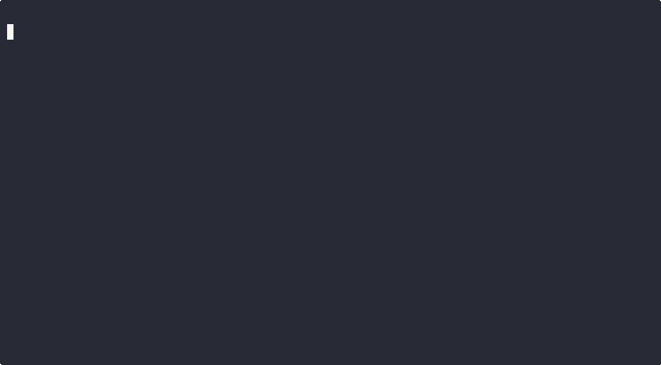
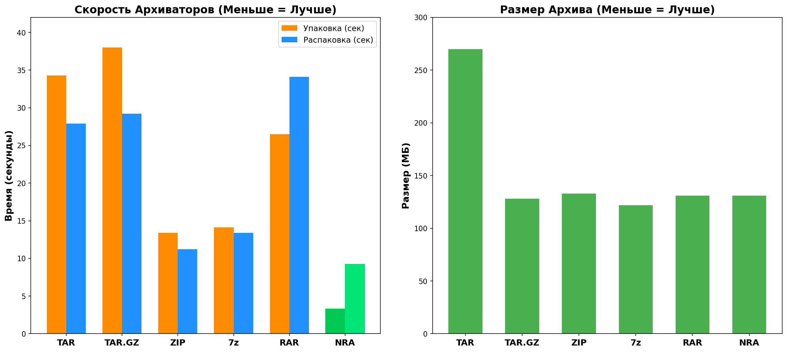
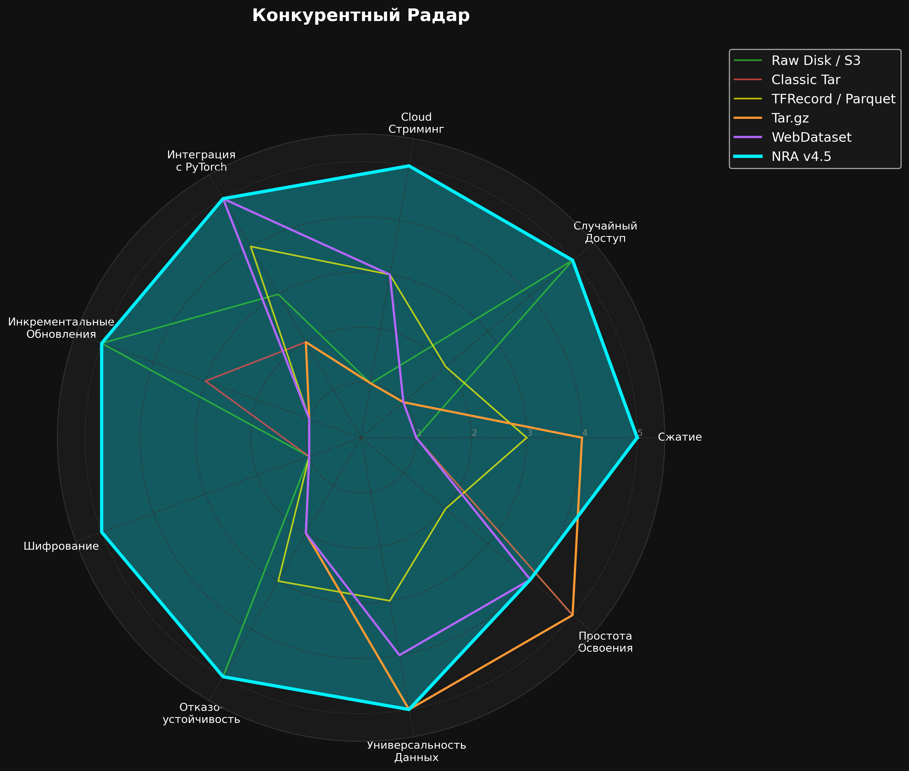
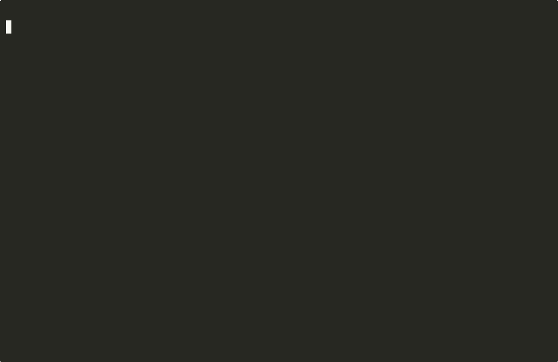
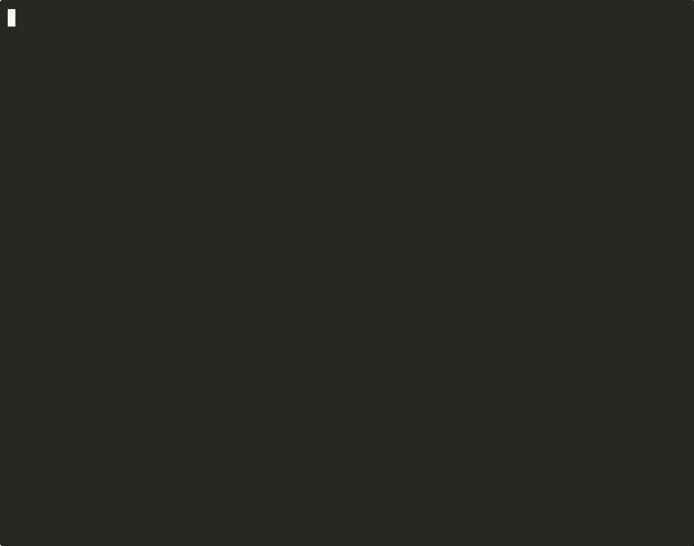
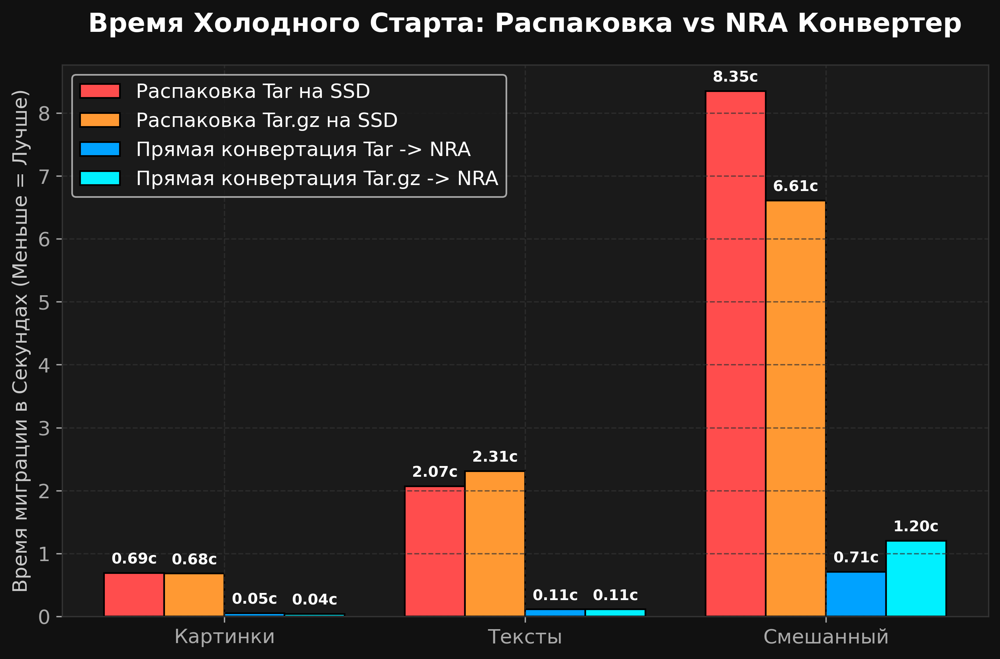
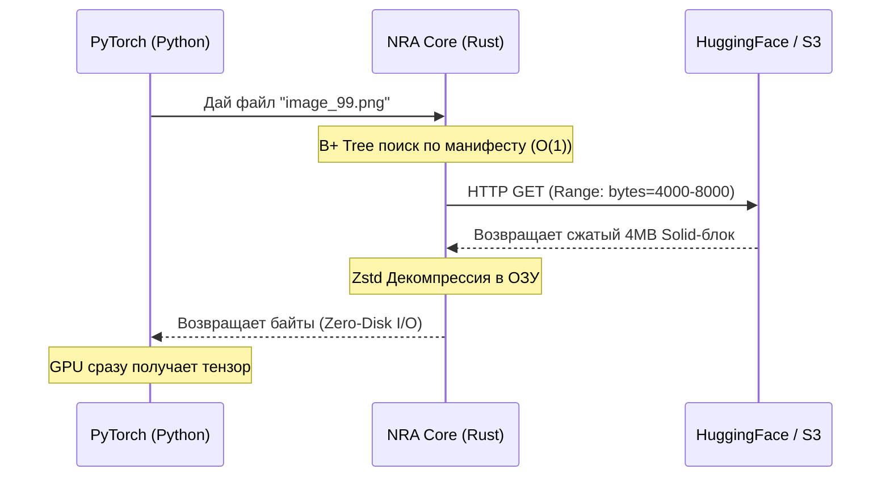

<div align="center">
  <h1>🧬 NRA (Neural Ready Archive)</h1>
  <p><b>Формат данных 21 века для эпохи ИИ. Забудьте про <code>tar.gz</code> и <code>zip</code>.</b></p>

  **🌐 Language / Язык: [English](README.md) | [Русский](README_RU.md)**

  [](https://pypi.org/project/nra/)
  [](https://pypi.org/project/nra/1.0.3/)
  [](https://www.rust-lang.org)
  [](LICENSE)
  [](https://huggingface.co/datasets/zevatov/nra-benchmarks)
</div>

<div align="center">
  
</div>

<br/>

Традиционные архиваторы (`ZIP`, `Tar.gz`) создавались в 90-х годах для дискет. Сегодня они являются главным **бутылочным горлышком** IT-инфраструктуры. Они заставляют вас скачивать 500 ГБ датасеты целиком, не умеют читать файлы из облака по частям и заставляют дорогие видеокарты (GPU) простаивать в ожидании данных.

**NRA (Neural Ready Archive)** — это бинарный формат нового поколения. Он объединяет энтерпрайз-дедупликацию, сверхбыстрое сжатие Zstd и B+ Tree индексы, чтобы вы могли обучать нейросети прямо из публичного облака.

---

## ⚡ Почему старые форматы мертвы? (Наши Бенчмарки)

Мы провели стресс-тест на 60,000 мелких файлов (CIFAR-10) на Mac OS:

| Формат | Время Упаковки | Скорость "Холодного Старта" (Стриминг) |
| :--- | :---: | :---: |
| 🛑 **Tar.gz** | 38.0 секунд | ~30 минут (Требует полного скачивания) |
| 🛑 **ZIP** | 13.4 секунд | Невозможно (Скачивание целиком) |
| 🏆 **NRA** | **3.3 секунды** (в 11.5x быстрее) | **150 миллисекунд** (Zero-Download) |

NRA выжимает 100% из всех ядер вашего процессора (благодаря Rust Rayon) и склеивает файлы в 4-мегабайтные Solid-блоки, обеспечивая мгновенный случайный доступ O(1).

<div align="center">
  
</div>

---

## 🏆 Конкурентный Радар: NRA против Всех

NRA v4.5 — **единственный** формат, который набирает максимум по **всем** техническим параметрам: Cloud Streaming, Random Access, PyTorch Integration, Шифрование, Дедупликация и Отказоустойчивость.

<div align="center">
  
</div>

> **Подробнее:** [Полный Технический Whitepaper](docs/nra_whitepaper_ru.md) с 8 графиками бенчмарков.

---

## 🚀 Попробуй Прямо Сейчас: Обучение без Скачивания

<div align="center">
  
</div>

### Вариант 1: Используй наш готовый NRA-датасет на Hugging Face

Мы разместили предобработанный CIFAR-10 в формате `.nra` на Hugging Face. **Обучи модель прямо сейчас, не скачивая ни одного байта:**

```bash
pip install nra==1.0.3 torch
```

```python
import nra
import torch
from torch.utils.data import Dataset, DataLoader

class NraStreamDataset(Dataset):
    def __init__(self, url):
        self.url = url
        # Манифест скачивается за 150мс. Сам архив остается в облаке!
        self.file_ids = nra.CloudArchive(url).file_ids()
        self._archive = None
        
    def __len__(self):
        return len(self.file_ids)
        
    def __getitem__(self, idx):
        if self._archive is None:
            self._archive = nra.CloudArchive(self.url)
        raw_bytes = self._archive.read_file(self.file_ids[idx])
        return torch.tensor([len(raw_bytes)], dtype=torch.float32)

# 🤗 Наш готовый датасет на Hugging Face (формат NRA)
dataset = NraStreamDataset(
    "https://huggingface.co/datasets/zevatov/nra-benchmarks/resolve/main/food-101.nra"
)
loader = DataLoader(dataset, batch_size=256, num_workers=4)

for batch in loader:
    # Обучение стартует на 0-й секунде. Ноль байт на вашем SSD!
    pass
```

> 🤗 **Все бенчмарк-датасеты на Hugging Face:** [**zevatov/nra-benchmarks**](https://huggingface.co/datasets/zevatov/nra-benchmarks) — Food-101, Wikitext, Pokemon, Minds14, GPT-2, Synthetic

### Вариант 2: Конвертируй ЛЮБОЙ существующий датасет на лету

<div align="center">
  
</div>

У вас уже есть `tar.gz` или `zip` на Hugging Face (или S3)? NRA может **конвертировать его в прямом эфире** и стримить результат — всё равно быстрее, чем скачивать оригинал:

```bash
# Конвертация tar.gz → NRA за 1-3 секунды (Zero-Disk I/O, чисто в RAM)
nra-cli convert --input dataset.tar.gz --output dataset.nra

# Затем стрим прямо из облака
python examples/stream_from_cloud.py --url https://your-server.com/dataset.nra
```

<div align="center">
  
</div>

> Конвертация `Tar.gz → NRA` занимает **0.71 секунды** против **8.35 секунд** распаковки на SSD. Это **в 11 раз быстрее**, и вы ни разу не касаетесь файловой системы.

---

## 🏗️ Как работает Облачная Архитектура (Zero-Disk I/O)



---

## 👔 Полный переход на формат (Плюсы и Минусы)

Зачем переводить вашу компанию на NRA?

### ✅ Плюсы (Почему это выгодно бизнесу)
- **Нулевой простой GPU:** Видеокарты за $30,000 больше не ждут жесткий диск. Данные скармливаются напрямую в память со скоростью процессора.
- **Экономия на S3 Storage:** Благодаря встроенной дедупликации (CDC), форки ваших LLM-моделей и бекапы будут занимать на 80% меньше места.
- **Мгновенная конвертация:** Перегонка старых архивов (`ZIP -> NRA` или `Tar.gz -> NRA`) происходит "на лету" в кэше процессора за 1-3 секунды.
- **Безопасность:** Встроенное AES-256-GCM шифрование энтерпрайз-уровня.

### ❌ Минусы (Честно)
- **Отсутствие нативной ОС интеграции:** Вы не сможете открыть `.nra` двойным кликом на компьютере бухгалтера (пока что).
- **Разовая конвертация:** Тяжелые `7z` и `RAR` архивы придется один раз распаковать на диск, чтобы упаковать в NRA (из-за проприетарных алгоритмов). Но вы делаете это один раз в жизни!

---

## 🛠️ Экосистема NRA

Мы создали полный набор инструментов для интеграции:

1. **Python SDK ([`pip install nra`](https://pypi.org/project/nra/)):** Интеграция в PyTorch и TensorFlow.
2. **NRA CLI (`cargo install nra-cli`):** Консольная утилита для серверов. Упаковка, распаковка, стриминг, **верификация** (`verify-beta`) и push на реестр.
3. **NRA GUI:** Элегантное настольное приложение (Windows/Mac/Linux) для визуального управления архивами. *(Сейчас в разработке: [zevatov/nra-manager-pro](https://github.com/zevatov/nra-manager-pro))*
4. **FUSE Mount:** Монтируйте `.nra` архивы как обычные виртуальные флешки прямо в файловую систему (`nra-cli mount`).
5. **🤗 Hugging Face Бенчмарки:** [zevatov/nra-benchmarks](https://huggingface.co/datasets/zevatov/nra-benchmarks) — готовые NRA-датасеты (Food-101, Wikitext, Pokemon, Minds14, GPT-2) для мгновенного облачного обучения.

---

## 🗺️ Roadmap

| Этап | Статус | Описание |
|------|--------|----------|
| **1.0** Ядро | ✅ Выпущено | NRA Format Spec v4.5: Solid-block Zstd/LZ4 сжатие, B+ Tree манифест, CDC дедупликация, AES-256-GCM шифрование |
| **1.0** Python SDK | ✅ Выпущено | `CloudArchive` стриминг, интеграция с PyTorch DataLoader, `pip install nra` |
| **1.0** CLI | ✅ Выпущено | `pack`, `unpack`, `convert`, `stream-beta`, `mount` (FUSE), `verify-beta`, `push` |
| **1.0** Delta Updates | ✅ Выпущено | `nra-cli append` — дозапись новых данных в существующие `.nra` архивы без полной пересборки |
| **1.0** NRA Registry | ✅ Выпущено | Приватный self-hosted реестр (`nra-registry-server`) + `nra-cli push` |
| **1.1** NRA Manager Pro | 🔧 В разработке | Кроссплатформенное GUI-приложение (Windows/Mac/Linux) с drag-and-drop управлением архивами |
| **1.2** Managed NRA CDN | 📋 Планируется | Edge-кэширующий прокси для корпоративных дата-центров — доставка с нулевой задержкой |
| **1.3** Streaming Converter | 📋 Планируется | Живая конвертация удалённых `tar.gz`/`zip` в NRA на лету, без промежуточного хранения |
| **2.0** Мультиплатформенные Wheels | 📋 Планируется | Готовые пакеты для Linux/Windows/Mac на PyPI (установка без Rust toolchain) |

---

## 📚 Глубокая документация проекта

Заинтересовались архитектурой под капотом? Изучите наши детальные отчеты в [Официальном Репозитории (zevatov/NRA)](https://github.com/zevatov/NRA):

- 📄 **[Technical Whitepaper (EN)](docs/nra_whitepaper.md)** — PyTorch throughput charts, Mmap tensor mechanisms, competitive benchmarks.
- 📄 **[Технический Whitepaper (RU)](docs/nra_whitepaper_ru.md)** — Полная русская версия с детальным анализом.
- 📊 **[Отчёт по архиваторам](docs/GENERAL_ARCHIVING_REPORT_RU.md)** — Как NRA уничтожает ZIP, 7z и RAR в повседневных задачах и бэкапах серверов.
- 🛠 **[Developer Guide](docs/NRA_DEVELOPER_GUIDE_RU.md)** — Для контрибьюторов: CDC, Solid-блоки, FUSE mount.
- 🤗 **[HuggingFace: Food-101 Card](docs/HF_README_FOOD101.md)** — Dataset card для Food-101 NRA бенчмарка.
- 🤗 **[HuggingFace: CIFAR-10 Card](docs/HF_README_CIFAR10.md)** — Dataset card для CIFAR-10 NRA демо.

## Лицензия
Ядро `nra-core`, `nra-cli` и `nra-python` распространяются под лицензией **MIT**.
