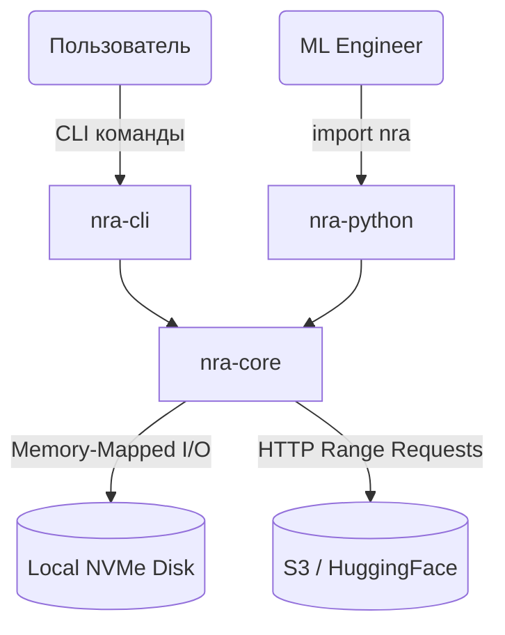
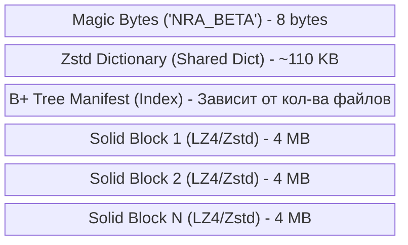

# Neural Ready Archive (NRA) — Руководство Разработчика (Developer Guide)

Добро пожаловать в проект **NRA (Neural Ready Archive)**. Этот документ предназначен для новых разработчиков (Junior/Middle+ уровня) и подробно объясняет, как устроен проект "под капотом", как взаимодействуют его компоненты и какие алгоритмы лежат в основе его феноменальной скорости.

---

## 1. Архитектура Проекта: С высоты птичьего полета

Проект NRA построен на гибридной архитектуре: ядро и критичные ко времени алгоритмы написаны на **Rust**, а интерфейс для машинного обучения проброшен в **Python** (через PyO3), так как конечные потребители — это ML-инженеры и Data Scientist'ы (PyTorch/TensorFlow).

Кодовая база разделена на 3 основных крейта (пакета):

1. **`nra-core`** — Фундаментальное ядро. Здесь лежат алгоритмы сжатия (Zstd, LZ4), криптографии (AES-256-GCM), дедупликации (FastCDC) и структуры данных манифеста (B+ Tree). Ядро ничего не знает о CLI или Python, оно просто работает с потоками байтов.
2. **`nra-cli`** — Утилита командной строки. Использует `nra-core` для предоставления команд пользователю (`pack`, `extract`, `convert`, `mount`, `info`). Реализует многопоточность для работы с локальной файловой системой.
3. **`nra-python`** — Биндинги (Bindings). Обертка над `nra-core`, которая превращает Rust-структуры в Python-объекты. Содержит логику `CloudArchive` для выполнения HTTP Range запросов к удаленным серверам прямо из PyTorch Dataloader.



---

## 2. Анатомия формата `.nra` v4.5

Главная инновация проекта — сам бинарный формат файла `.nra`. В отличие от `tar` или `zip`, формат разработан для **O(1) случайного доступа** по сети.

Структура файла `.nra` выглядит следующим образом:



### 2.1 Манифест (Manifest)
Вместо того чтобы размазывать метаданные (имена файлов) по всему архиву (как в `tar`), манифест лежит **строго в начале файла**.
Манифест — это сериализованная таблица (часто структурированная как B+ Tree в RAM), где ключом является имя файла (например, `image_001.jpg`), а значением — структура с координатами:
- Идентификатор (хэш) чанка
- Смещение (Offset) в байтах внутри архива
- Размер сжатого и несжатого чанка

*Почему это важно?* При Cloud Streaming'е `nra-python` делает ровно один HTTP GET запрос на первый мегабайт файла, загружает Манифест в ОЗУ, и теперь знает точные байтовые адреса всех миллионов файлов в облаке!

### 2.2 Solid Блоки и Чанки (Chunks)
Файлы внутри архива разбиваются на "Чанки" (Chunks). Несколько чанков объединяются в **Solid-блок** (обычно 4-8 Мегабайт).
Сжатие применяется не к каждому файлику отдельно, а к Solid-блоку целиком. Это повышает коэффициент сжатия мелких файлов (текстов, логов) до 21x раз, так как алгоритм видит широкий контекст. При извлечении одного файла NRA скачивает нужный Solid-блок, кэширует его в RAM (LRU Cache) и мгновенно отдает запрошенный файл.

---

## 3. Как работает Дедупликация (Алгоритм CDC)

В основе режима **NRA BETA** лежит Content-Defined Chunking (CDC). Это тот же алгоритм, что используется в энтерпрайз-системах бэкапов (Borg, Restic).

Если у тебя в датасете лежит 100 одинаковых конфигурационных JSON файлов, `tar` сохранит их 100 раз. NRA сохранит его 1 раз.

**Как это работает в коде (`nra-core/src/beta_writer.rs`):**
1. Файл читается как поток байтов.
2. Алгоритм плавающего окна (FastCDC или Rabin Fingerprint) бежит по байтам и ищет "границы". Как только хэш окна удовлетворяет математическому условию (например, `hash % 8192 == 0`), граница установлена.
3. Полученный кусок байтов (чанк) хэшируется алгоритмом Blake3.
4. Хэш ищется во внутренней таблице `HashSet`. Если такой хэш уже был — мы просто записываем ссылку на старый блок в Манифест файла. Фактические данные на диск не пишутся!

---

## 4. Пайплайны (Жизненный цикл данных)

### 4.1 Пайплайн Записи (Команда `pack` или `convert`)

Когда юзер запускает `nra-cli pack`, происходит следующее:
1. Инициализируется пул потоков (Thread Pool) через **Rayon**.
2. Главный поток обходит файловую систему (WalkDir) и отправляет пути файлов в очередь.
3. Рабочие потоки читают файлы, применяют CDC-алгоритм для нарезки на чанки и хэшируют их.
4. Уникальные чанки отправляются в компрессор. Первые N файлов используются для "обучения" Zstd-словаря (Zstd Dictionary Training), который затем вшивается в начало архива.
5. Сжатые блоки (опционально) шифруются поточным шифром **AES-256-GCM**.
6. Главный поток `BetaWriter` последовательно (Sequential I/O) пишет блоки в файл и обновляет Манифест.

### 4.2 Пайплайн Чтения (Cloud Streaming & Dataloader)

Самая мощная часть системы реализована в `nra-python/src/lib.rs`:

```python
import nra
dataset = nra.CloudArchive("https://huggingface.co/...")
image = dataset.read_file("cifar/image_49999.png")
```

1. **`CloudArchive.__new__`**: Rust делает HTTP Range запрос на первые 2 МБ файла. Манифест десериализуется в структуру `HashMap<String, FileMetadata>`.
2. **`read_file("...")`**: Ищем строку "cifar/image_49999.png" в Манифесте (Время O(1)).
3. Узнаем, что этот файл лежит в блоке #45 (Оффсет: `150045000` байт, Размер: `4096000` байт).
4. Делаем HTTP Range запрос: `GET /file.nra HTTP/1.1\nRange: bytes=150045000-154141000`.
5. Скачанный зашифрованный блок попадает в RAM. Расшифровывается AES-256-GCM. Декомпрессируется LZ4 или Zstd.
6. Выделяется `PyBytes` объект нужного файла и возвращается в Python.
7. Распакованный блок остается в `LRU Cache`. Если следующий файл будет лежать в том же блоке, запроса к сети не произойдет вообще!

---

## 5. Главный инсайт для разработчика: Random I/O vs Sequential I/O

Если кто-то спросит: *"Зачем вообще NRA, почему не распаковывать tar.gz?"*

Вы должны понимать разницу между I/O:
* Операционная система при создании файла вызывает `open()`, выделяет Inode, пишет метаданные директории. Создание 60,000 файлов на SSD — это пытка для диска (Random I/O). Это долго.
* Когда `nra-cli` конвертирует `tar.gz`, он пишет данные в ОДИН файл. Это одна непрерывная транзакция (Sequential I/O), которая в 11 раз быстрее.
* Когда PyTorch читает файлы из `nra.BetaArchive` на локальном диске, мы используем `memmap2` (Memory-mapped files). Мы просто просим ядро ОС (mmap syscall) сделать так, чтобы файл на диске выглядел как массив в оперативной памяти (Zero-copy read). Операционная система берет на себя весь page-caching. Мы обходим 90% бутылочных горлышек ОС!

---

Удачи в разработке NRA! Если вы меняете структуру манифеста, **обязательно** обновляйте Magic Bytes и версионирование, чтобы не сломать совместимость со старыми датасетами.
